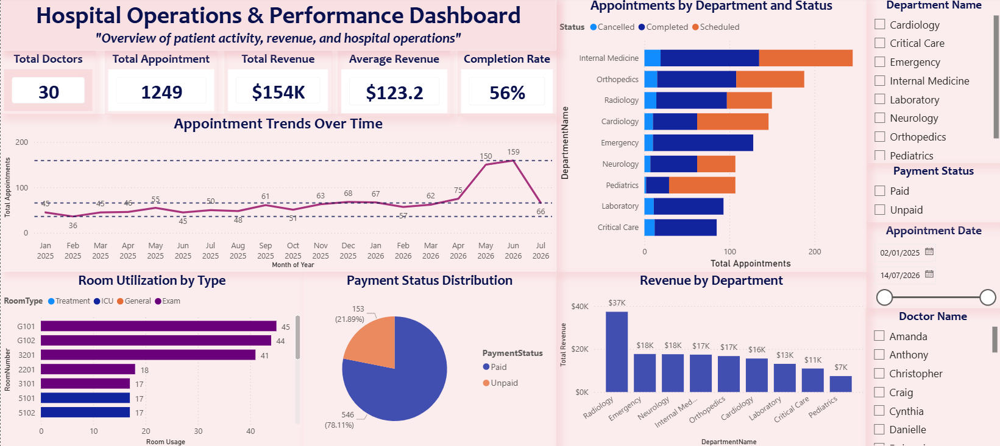
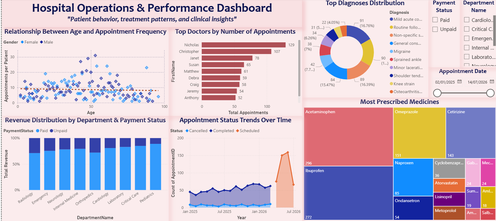

# Hospital Operations & Clinical Analytics Dashboard

## Project Overview
This project presents a complete healthcare analytics solution built using SQL Server and Power BI. The system was designed to simulate hospital operations through a normalized relational database and interactive business intelligence dashboards.

The project combines database modeling, synthetic healthcare data generation, SQL querying, and advanced Power BI visualizations to analyze operational performance, patient activity, financial metrics, appointment trends, diagnoses, prescriptions, and room utilization.

---

## Key Features
- Normalized SQL Server relational database design
- Physical ERD and DDL implementation
- Synthetic healthcare data generation
- Business Intelligence SQL queries
- Interactive Power BI dashboard
- KPI tracking and operational analytics
- Appointment and revenue trend analysis
- Department level performance insights
- Diagnosis and prescription analytics
- Room utilization reporting

---

## Tools & Technologies
- SQL Server
- Power BI
- Power query

---

## Dashboard Highlights
### Page 1 – Hospital Operations Overview
- Appointment trends over time
- Revenue by department
- Payment status distribution
- Room utilization analysis
- Department performance monitoring
- Operational KPI cards

### Page 2 – Clinical & Patient Analytics
- Relationship between age and appointment frequency
- Top doctors by appointments
- Diagnosis distribution analysis
- Prescription and medicine analytics
- Appointment status trends
- Revenue distribution insights

## Screenshots

---

## Business Intelligence Questions

This project explored operational healthcare analytics questions using SQL queries and Power BI visualizations, including:

- What is the average number of appointments per patient?
- Which doctors have the highest patient load?
- Which departments generate the highest revenue?
- What are the most prescribed medicines?
- What percentage of rooms are occupied by room type?
- How do appointment statuses vary over time?
- How many appointments were scheduled, completed, cancelled, or marked as no-show?

---

## Notes
- Synthetic healthcare data was generated for educational and analytical purposes only.
- Patient identifiable information was intentionally excluded for privacy and realism.
---

## Author
Zainularab Zarabi
